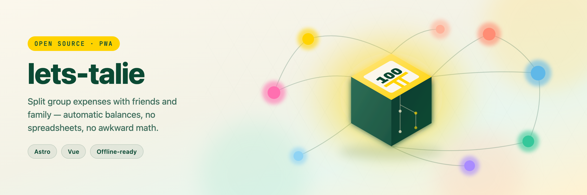

# lets-talie

A self-hostable PWA for tracking shared expenses between friends and family. Create a group, log who paid for what, and lets-talie works out who owes whom — automatically.

A negative balance means you owe the group; a positive balance means the group owes you.

**Live demo:** [Demo](https://lets-talie-demo.kawishbit.com) 

## Tech stack

- [Astro](https://docs.astro.build) with a [Vue](https://docs.astro.build/en/guides/framework-components/) integration for interactive islands
- [Tailwind CSS](https://docs.astro.build/en/guides/styling/) — see [DESIGN.md](DESIGN.md) for UI conventions before touching components or pages
- [Drizzle ORM](https://orm.drizzle.team/) over Postgres (via the `postgres-js` driver)
- [Better Auth](https://www.better-auth.com/) (passwordless email OTP / magic link)
- [Node](https://nodejs.org) (22+) as the app runtime; [Bun](https://bun.sh) as the package manager and task runner
- PWA support via service worker (offline shell, installable)

## Development

```sh
bun install
cp .env.example .env   # fill in BETTER_AUTH_SECRET, DATABASE_URL, SMTP_*
bun run migrate
astro dev --background  # or: bun run dev
```

Useful scripts:

| Command | Action |
| --- | --- |
| `bun run dev` | Start the dev server (port 30001) |
| `bun run build` | Production build (Node adapter by default) |
| `bun run migrate` | Apply Drizzle migrations |
| `bun run start` | Run a production build (`bun run build` first) |
| `bun run check` | Lint + format check (Biome) |
| `bun run check:fix` | Lint + format, applying fixes |

## Deployment options

The same codebase ships three ways. All three read configuration from environment variables — see the [reference table](#environment-variables) below.

### Docker Compose (recommended for self-hosting)

```sh
git clone <repo-url> && cd lets-talie
cp .env.example .env   # fill in BETTER_AUTH_SECRET, BETTER_AUTH_URL, SMTP_*
docker compose up -d
```

This starts Postgres and the app together, runs migrations on boot, and serves on `http://localhost:30001` (override with `APP_PORT` in `.env` if that port is taken).

### Bare-metal / clone & run

```sh
git clone <repo-url> && cd lets-talie
bun install
# provision Postgres yourself and set DATABASE_URL in .env
cp .env.example .env
bun run build
bun run migrate
bun run start
```

The app binds to `localhost` by default here, which is correct if you're putting a reverse proxy in front of it. Set `HOST=0.0.0.0` if you need it reachable directly.

### Vercel

Clone the repo (privately or publicly, your call), bring any external Postgres (Supabase, Neon, Vercel Postgres, etc.), and deploy. Vercel doesn't run a database for you.

1. Import the repo into a new Vercel project.
2. Select the Vercel adapter at build time, either way works:
   - Set `ADAPTER=vercel` as a Vercel project environment variable (simplest — Vercel's default Build Command already runs `astro build`), or
   - Override the project's Build Command to `ADAPTER=vercel bun run build`.

   Install Command (`bun install`) and Output Directory are auto-detected once `@astrojs/vercel` is installed; no `vercel.json` is needed.
3. Point `DATABASE_URL` at your Postgres provider (e.g. a Supabase connection string).
4. Set the auth vars: `BETTER_AUTH_SECRET`, `BETTER_AUTH_URL` (your Vercel domain), and the `SMTP_*` vars for passwordless login emails.
5. Run migrations against that database once, before first traffic: `DATABASE_URL=<remote> bun run migrate` (run locally, or as a one-off Vercel deploy hook).

## Environment variables

| Variable | Where | Description |
| --- | --- | --- |
| `ADAPTER` | Build-time | `vercel` for the Vercel build; unset for the Node/Docker/bare-metal build. |
| `BETTER_AUTH_SECRET` | All | Auth signing secret. Generate with `openssl rand -base64 32`. |
| `BETTER_AUTH_URL` | All | Public URL the app is served at (no trailing slash). |
| `SMTP_HOST` / `SMTP_PORT` / `SMTP_SECURE` / `SMTP_USER` / `SMTP_PASS` / `SMTP_FROM` | All | Outbound mail for passwordless login codes/magic links. |
| `PUBLIC_CURRENCY_CODE` | All | ISO 4217 code used for formatting amounts (e.g. `USD`). |
| `DATABASE_URL` | All except Docker Compose | Postgres connection string. Docker Compose sets this automatically for the `db` service. |
| `APP_PORT` / `DB_PORT` | Docker Compose only | Host-side port overrides, in case 30001 / 5433 are already taken locally. |

See [.env.example](.env.example) for a copy-pasteable template with defaults and comments.
