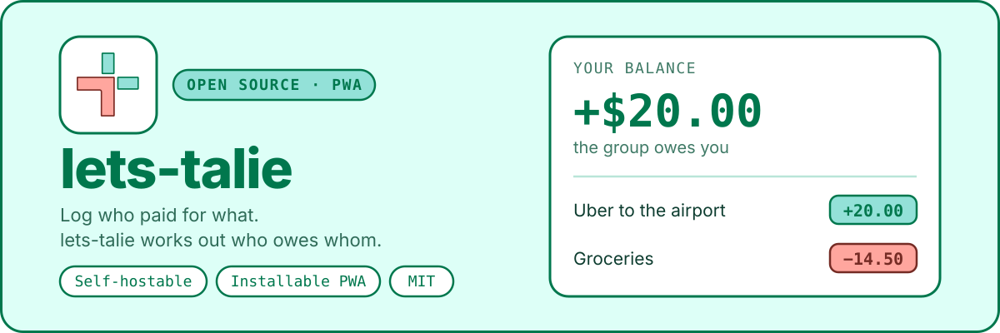
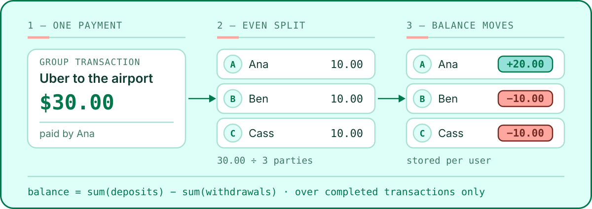
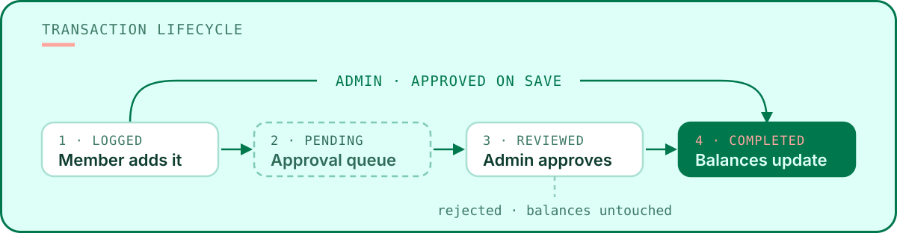

<a name="readme-top"></a>

<p align="center">
  
</p>

<p align="center">
  <strong>Log who paid for what. lets-talie works out who owes whom.</strong><br />
  A self-hostable, installable PWA for shared expenses between friends, flatmates, and family.
</p>

<p align="center">
  
  
  
  
  
</p>

<p align="center">
  <a href="https://lets-talie-demo.kawishbit.com"><strong>Try the live demo&nbsp;&rarr;</strong></a>
</p>

<p align="center">
  <a href="#the-split-worked-out-for-you">How it works</a>
  &middot;
  <a href="#run-it">Run it</a>
  &middot;
  <a href="#self-hosting">Self-hosting</a>
  &middot;
  <a href="#environment-variables">Configuration</a>
  &middot;
  <a href="#development">Development</a>
</p>

<br />

## The split, worked out for you

<p align="center">
  
</p>

Ana, Ben, and Cass share a $30 Uber that Ana paid for. Log it once as a **group transaction** and every balance moves at the same time: Ana **+$20**, Ben and Cass **−$10** each. Splits can be even, or given custom per-party amounts.

A **negative** balance means you owe the group; a **positive** balance means the group owes you. Balances are stored per user and recalculated after every approved change rather than derived on read, so history stays fast to load no matter how long the ledger gets.

<p align="right">(<a href="#readme-top">back to top</a>)</p>

## Approval, not just logging

<p align="center">
  
</p>

A shared ledger is only worth trusting if someone is watching it. Transactions logged by a regular user land in the **approval queue** and change nothing until an admin approves them; an admin's own entries are approved on save. Rejected entries leave every balance untouched. Admins can work through the queue one group at a time or in bulk.

<p align="right">(<a href="#readme-top">back to top</a>)</p>

## Run it

Docker Compose is the shortest path — it starts Postgres and the app together and runs migrations on boot.

```sh
git clone <repo-url> && cd lets-talie
cp .env.example .env   # fill in BETTER_AUTH_SECRET, BETTER_AUTH_URL, SMTP_*
docker compose up -d
```

The app is then on `http://localhost:30001`. Sign in with a magic link sent to your email, add the people you share money with, and log the first transaction.

> Port 30001 or 5433 already taken? Override `APP_PORT` / `DB_PORT` in `.env`.

Prefer bare metal or Vercel? See [Self-hosting](#self-hosting).

<p align="right">(<a href="#readme-top">back to top</a>)</p>

## What you get

- **Group transactions** — split one payment across multiple people, evenly or with custom per-party amounts
- **Single transactions** — record an individual deposit or withdrawal
- **Automatic balances** — `sum(deposits) − sum(withdrawals)` over completed transactions, stored per user
- **Approval workflow** — admin transactions auto-approve; everyone else's wait in the queue
- **Bulk approvals** — clear pending transaction groups individually or in bulk
- **CSV / JSON import** — validated bulk import that recalculates balances afterward
- **Admin CRUD** — full management of transactions, users, and categories
- **Passwordless auth** — email OTP / magic link login, no passwords to store or leak
- **Installable PWA** — service worker, offline shell, installable to the home screen

### Where things live

| Path | Access | Page |
| --- | --- | --- |
| `/` | All | Balance + add group/single transaction forms |
| `/transactions` | All | Transaction history, with filters and sorting |
| `/approve-transactions` | Admin | Pending transaction group approvals |
| `/import-transactions` | Admin | CSV/JSON import with validation |
| `/users` | Admin | User list + CRUD |
| `/transaction-categories` | Admin | Category list + CRUD |

<p align="right">(<a href="#readme-top">back to top</a>)</p>

## Self-hosting

The same codebase ships three ways. All three read configuration from environment variables — see the [reference table](#environment-variables) below.

### Docker Compose (recommended)

See [Run it](#run-it) above. Postgres and the app come up together, migrations run on boot, and the app serves on `http://localhost:30001`.

### Bare metal

```sh
git clone <repo-url> && cd lets-talie
bun install
cp .env.example .env   # provision Postgres yourself and set DATABASE_URL
bun run build
bun run migrate
bun run start
```

The app binds to `localhost` here, which is correct if you're putting a reverse proxy in front of it. Set `HOST=0.0.0.0` if you need it reachable directly.

### Vercel

Bring any external Postgres (Supabase, Neon, Vercel Postgres, etc.) — Vercel doesn't run a database for you.

1. Import the repo into a new Vercel project.
2. Select the Vercel adapter at build time, either way works:
   - Set `ADAPTER=vercel` as a Vercel project environment variable (simplest — Vercel's default Build Command already runs `astro build`), or
   - Override the project's Build Command to `ADAPTER=vercel bun run build`.

   Install Command (`bun install`) and Output Directory are auto-detected once `@astrojs/vercel` is installed; no `vercel.json` is needed.
3. Point `DATABASE_URL` at your Postgres provider (e.g. a Supabase connection string).
4. Set the auth vars: `BETTER_AUTH_SECRET`, `BETTER_AUTH_URL` (your Vercel domain), and the `SMTP_*` vars for passwordless login emails.
5. Run migrations against that database once, before first traffic: `DATABASE_URL=<remote> bun run migrate` (run locally, or as a one-off Vercel deploy hook).

<p align="right">(<a href="#readme-top">back to top</a>)</p>

## Environment variables

| Variable | Where | Description |
| --- | --- | --- |
| `ADAPTER` | Build-time | `vercel` for the Vercel build; unset for the Node/Docker/bare-metal build. |
| `BETTER_AUTH_SECRET` | All | Auth signing secret. Generate with `openssl rand -base64 32`. |
| `BETTER_AUTH_URL` | All | Public URL the app is served at (no trailing slash). |
| `SMTP_HOST` / `SMTP_PORT` / `SMTP_SECURE` / `SMTP_USER` / `SMTP_PASS` / `SMTP_FROM` | All | Outbound mail for passwordless login codes/magic links. |
| `PUBLIC_CURRENCY_CODE` | All | ISO 4217 code used for formatting amounts (e.g. `USD`). |
| `DATABASE_URL` | All except Docker Compose | Postgres connection string. Docker Compose sets this automatically for the `db` service. |
| `APP_PORT` / `DB_PORT` | Docker Compose only | Host-side port overrides, in case 30001 / 5433 are already taken locally. |

See [.env.example](.env.example) for a copy-pasteable template with defaults and comments.

<p align="right">(<a href="#readme-top">back to top</a>)</p>

## Development

You'll need [Bun](https://bun.sh) (package manager / task runner), [Node](https://nodejs.org) 22+, a Postgres database, and SMTP credentials for login emails.

```sh
bun install
cp .env.example .env   # fill in BETTER_AUTH_SECRET, DATABASE_URL, SMTP_*
bun run migrate
bun run dev            # port 30001
```

| Command | Action |
| --- | --- |
| `bun run dev` | Start the dev server (port 30001) |
| `bun run build` | Production build (Node adapter by default, `ADAPTER=vercel` for Vercel) |
| `bun run preview` | Preview a production build locally |
| `bun run start` | Run a built server under Node (`bun run build` first) |
| `bun run migrate` | Apply Drizzle migrations |
| `bun run seed:demo` | Seed the demo account + sample data (`DEMO_USER_EMAIL` required) |
| `bun run check` | Lint + format check (Biome) |
| `bun run check:fix` | Lint + format, applying fixes |
| `bun run test` | Run the test suite (Vitest) |
| `bun run assets:icons` | Regenerate every favicon and PWA icon from `logo/logo.svg` |

### Built with

| Layer | Choice |
|-------|--------|
| App shell | [Astro](https://astro.build) + [Vue](https://vuejs.org) islands |
| Styles | [Tailwind CSS](https://tailwindcss.com) · UI conventions in [DESIGN.md](DESIGN.md) |
| Language | TypeScript |
| Database | [Drizzle ORM](https://orm.drizzle.team/) over Postgres (`postgres-js` driver) |
| Auth | [Better Auth](https://www.better-auth.com/) (passwordless email OTP / magic link) |
| Runtime | [Node](https://nodejs.org) ≥ 22 |
| Tooling | [Bun](https://bun.sh) (package manager · task runner) |
| PWA | service worker (offline shell, installable) |
| Deploy | Docker Compose · bare-metal Node · Vercel |

<p align="right">(<a href="#readme-top">back to top</a>)</p>

## Brand assets

`logo/logo.svg` is the single vector source. Every favicon and PWA icon is rasterised from it by `bun run assets:icons`, each at its final pixel size — so edit the vector and re-run rather than touching the PNGs by hand.

| Asset | File |
| --- | --- |
| Vector source | [`logo/logo.svg`](logo/logo.svg) |
| Logo (raster, 1000px) | [`logo/logo.png`](logo/logo.png) |
| Banner | [`assets/readme/banner.svg`](assets/readme/banner.svg) |
| README diagrams | [`assets/readme/split.svg`](assets/readme/split.svg) · [`assets/readme/lifecycle.svg`](assets/readme/lifecycle.svg) |
| Favicons | [`public/`](public) — `favicon.svg`, `favicon.ico`, `favicon-16x16.png`, `favicon-32x32.png` |
| PWA icons | [`public/`](public) — `pwa-{192,512,1024}.png`, `pwa-maskable-{192,512,1024}.png`, `apple-touch-icon.png` |

The palette is mint `#DDFFF7`, teal `#93E1D8` on `#00774D`, and coral `#FFA69E` on `#752B24`; the README visuals reuse it so the page and the app icon read as one system.

<p align="right">(<a href="#readme-top">back to top</a>)</p>

## License

Released under the [MIT License](LICENSE).

## Acknowledgments

- [Astro](https://astro.build) and [Vue](https://vuejs.org) for the app shell and interactive islands
- [Tailwind CSS](https://tailwindcss.com) for styling
- [Drizzle ORM](https://orm.drizzle.team/) for the type-safe Postgres layer
- [Better Auth](https://www.better-auth.com/) for passwordless authentication
- [Bun](https://bun.sh) for package management and task running
